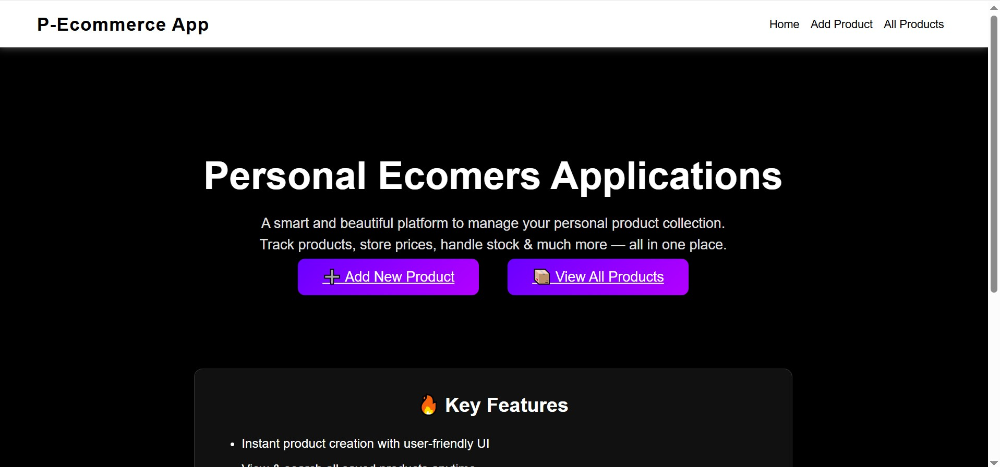
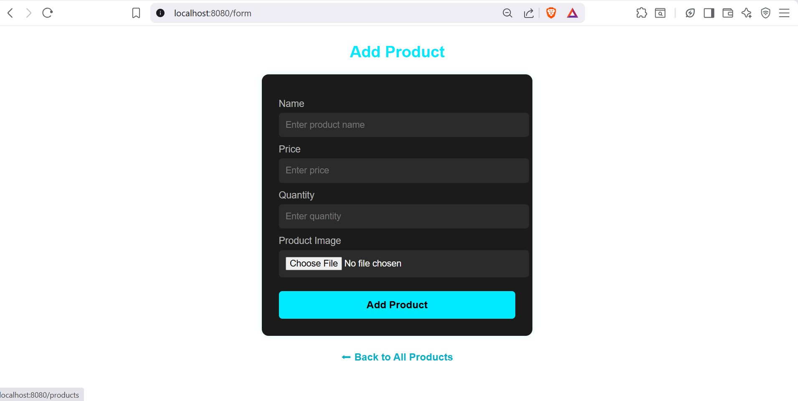
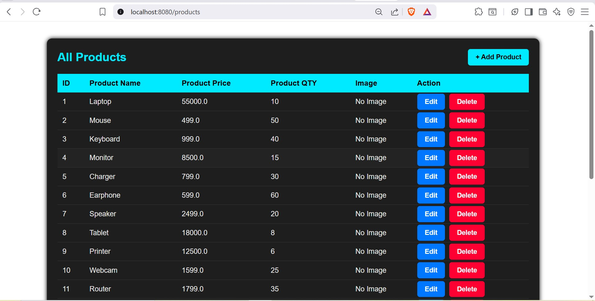

<h1 align="center">🛒 Personal Ecommerce Application</h1>
<p align="center">
  <b>A simple and elegant Spring Boot based ecommerce product management system</b>
</p>

## 📸 Screenshots

### 🏠 Home Page



### ➕ Add Product Page


### 📋 Product List Page


---

## 🚀 Features

- Add New Product  
- View All Products  
- Update Existing Product  
- Delete Product  
- Image Upload & Display  
- MySQL Database Integration  
- Clean & Modern UI (Black & White Theme)  

---

## 🛠️ Technologies Used

| Technology | Description |
|-----------|-------------|
| Java | Backend logic |
| Spring Boot | Main framework |
| Spring MVC | Web layer |
| Spring Data JPA | Database mapping |
| MySQL | Database |
| Thymeleaf | Frontend templates |
| HTML / CSS | UI |
| GSAP | Animations |
| Maven | Dependency management |


👤 Author

Tejas Indurkar
📌 If you like this project, don't forget to ⭐ star the repo!

<h3 align="center">✨ Thank you for visiting! Happy Coding! ✨</h3> ```
